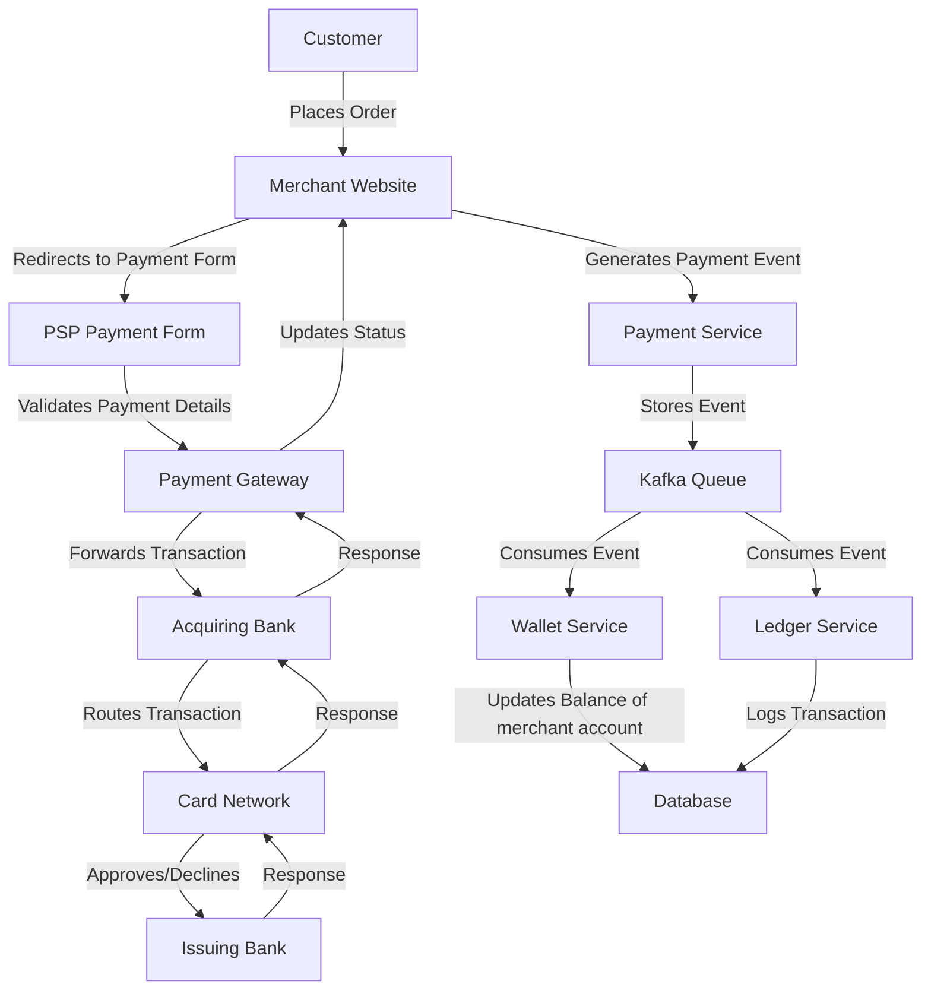
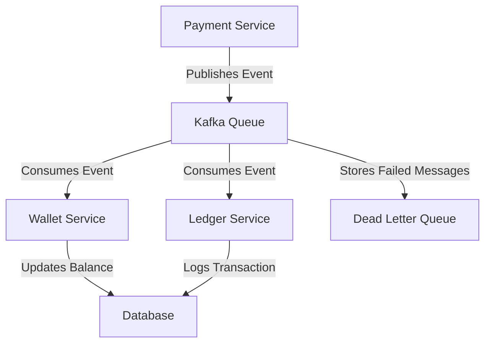
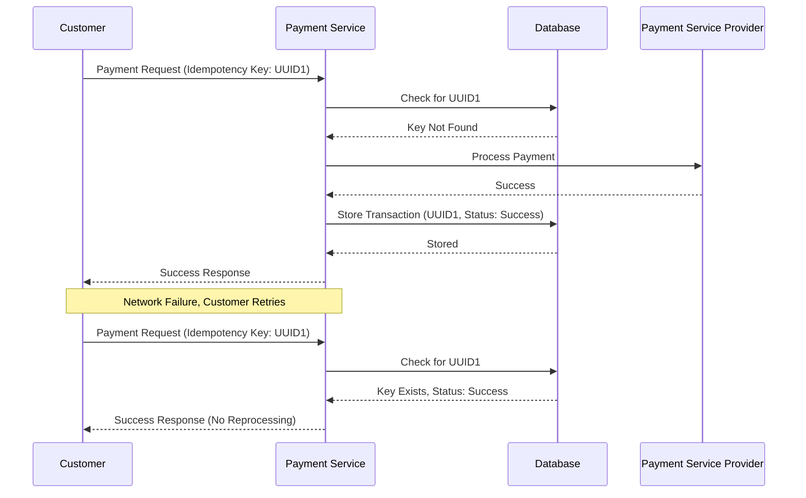

The transcript provides a comprehensive overview of designing and implementing a reliable and scalable payment system for e-commerce platforms. It covers the architecture, challenges, and technical strategies involved in building such systems, emphasizing reliability, scalability, security, and fault tolerance. Below is an analysis of the key concepts, followed by explanations and diagrams to illustrate the system design and processes.

---

## Analysis of the Transcript

### 1.Overview of E-commerce Payment Systems
The transcript begins by highlighting the growth of e-commerce and the critical role of payment systems in facilitating online transactions. A payment system ensures secure, reliable, and scalable money transfers between customers and merchants. Key challenges include:
- **Reliability**: Ensuring transactions are processed correctly without errors.
- **Availability**: Minimizing downtime to avoid revenue loss.
- **Scalability**: Handling large volumes of transactions as the business grows.
- **Security**: Complying with regulations like PCI DSS and GDPR to protect sensitive data.

### 2. High-Level Payment System Workflow
The payment process involves multiple entities:
- **Customer**: Initiates a transaction by placing an order and providing payment details.
- **Merchant**: Hosts the e-commerce platform and integrates with a payment system.
- **Payment Gateway**: Validates financial credentials and ensures compliance with regulations.
- **Payment Service Provider (PSP)**: A third-party service (e.g., Stripe, PayPal) that facilitates secure payment processing, including risk management and reconciliation.
- **Acquiring Bank**: Processes payments on behalf of the merchant.
- **Card Network**: Routes transaction details between the acquiring bank and the issuing bank (e.g., Visa, Mastercard).
- **Issuing Bank**: Approves or declines the transaction based on the cardholder’s account status.

### 3. **Functional and Non-Functional Requirements**
- **Functional Requirements**:
  - Move money from the customer’s account to the merchant’s account.
  - Handle payment events, store transaction data, and update account balances.
- **Non-Functional Requirements**:
  - **Reliability**: Ensure transactions are processed correctly even during failures.
  - **Scalability**: Support high transaction throughput.
  - **Availability**: Minimize downtime to avoid revenue loss.
  - **Security**: Protect sensitive data and comply with regulations.
  - **Fault Tolerance**: Handle network failures, service downtime, and inconsistencies.

### 4. **Using a Payment Service Provider (PSP)**
Most e-commerce platforms use PSPs to simplify payment processing. PSPs handle compliance, store sensitive card data, and provide payment forms, reducing the burden on merchants. Direct connections to banks or card schemes are complex due to regulatory requirements and are less common. ex. stripe, paypal

### 5. System Design Components
The transcript outlines a payment system architecture with the following components:
- **Payment Service**: Coordinates the payment process, interacts with the PSP, and updates internal services.
- **Database**: Stores payment events, wallet balances, and ledger records.
- **Wallet Service**: Tracks the merchant’s account balance.
- **Ledger Service**: Logs financial transactions for auditing and revenue calculation.
- **PSP Integration**: Handles communication with external PSPs for payment processing.
- **Messaging Queue (e.g., Kafka)**: Ensures reliable message delivery between services.

### 6. Communication Patterns
- **Synchronous Communication**: A service waits for a response before proceeding. This is suitable for real-time scenarios (e.g., physical store payments) but is prone to cascading failures if a service is down or slow.
- **Asynchronous Communication**: Services do not wait for responses, using queues like Kafka to buffer requests. This is preferred for large-scale systems due to loose coupling, fault tolerance, and scalability.

### 7. **Handling Failures**
The transcript discusses several strategies to ensure reliability:
- **Retries**: Automatically retry failed requests due to temporary issues (e.g., network failures) using strategies like fixed intervals, incremental intervals, or exponential backoff with jitter.
- **Timeouts**: Prevent requests from hanging indefinitely by setting a maximum wait time. However, timeouts can lead to uncertainty about transaction status.
- **Fallbacks**: Use default values or business rules (e.g., approving small transactions) when a dependent service fails.
- **Dead Letter Queues**: Store problematic messages (e.g., poison pills) for later debugging.
- **Idempotency**: Prevent duplicate transactions by using unique keys (e.g., UUIDs) to ensure a request is processed only once.

### 8. **Scalability and Distributed Systems**
To handle high transaction volumes, the system can be distributed across multiple machines. Benefits include:
- **Redundancy**: Replication ensures data availability during failures.
- **Load Distribution**: Balances workload across machines.
- **Fault Tolerance**: Continues functioning despite component failures.
- **Scalability**: Adds or removes resources as needed.

Challenges include data consistency and replication lag, which require careful management of consistency levels.

### 9. **Security Measures**
- **Encryption**: Encrypt data at rest (e.g., disk/database encryption) and in transit (e.g., TLS, HTTPS).
- **Access Control**: Restrict data access to authorized users, using methods like two-factor authentication.
- **Software Updates**: Regularly patch software to address vulnerabilities.
- **Backups**: Protect against data loss or ransomware by maintaining regular backups.
- **Strong Passwords**: Use complex passwords to prevent attacks using rainbow tables.
- **Data Integrity Monitoring**: Use cryptographic checksums to detect unauthorized changes to data.

### 10. **Key Tools and Patterns**
- **Apache Kafka**: Persists messages to ensure reliable communication between services.
- **Idempotency Keys**: Prevent duplicate transactions.
- **Exponential Backoff with Jitter**: Spreads out retry attempts to avoid overwhelming services.
- **Dead Letter Queues**: Isolates problematic messages for debugging.
- **Distributed Systems**: Enhance scalability and reliability.

---

## Explanation of Key Concepts

### Payment System Workflow
The payment process involves a sequence of steps:
1. A customer places an order and provides payment details.
2. The merchant redirects the customer to a PSP-hosted payment form.
3. The PSP validates the payment details and forwards them to the acquiring bank.
4. The acquiring bank routes the transaction through the card network to the issuing bank.
5. The issuing bank approves or declines the transaction based on the cardholder’s balance and account status.
6. The response travels back through the same path to the merchant, who updates the customer on the transaction status.

### Asynchronous Communication with Kafka
Asynchronous communication decouples services, allowing them to operate independently. Kafka acts as a persistent queue, storing messages until they are consumed by services. This ensures messages are not lost, even if a service is temporarily unavailable. For example:
- A payment event is generated when a customer places an order.
- The event is stored in Kafka and consumed by the payment service, wallet service, and ledger service.
- If a service is down, Kafka retains the message until the service recovers.

### Idempotency
Idempotency ensures that retrying a payment does not result in duplicate charges. A unique idempotency key (e.g., a UUID) is included in the request. The payment system checks the database for the key:
- If the key is new, the transaction is processed and stored.
- If the key exists, the system returns the status of the previous request without reprocessing.

### Retry Strategies
Retries are critical for handling transient failures (e.g., network issues). Common strategies include:
- **Fixed Intervals**: Retry after a fixed delay (e.g., 1 second).
- **Incremental Intervals**: Increase the delay with each retry (e.g., 1s, 2s, 3s).
- **Exponential Backoff with Jitter**: Double the delay with each retry (e.g., 1s, 2s, 4s) and add randomness to prevent synchronized retries.

### Security
Security is paramount in payment systems. Encryption (e.g., TLS, HTTPS) protects data in transit, while access controls and regular backups safeguard against unauthorized access and data loss. Data integrity monitoring detects unauthorized changes, ensuring the system remains secure.

---

## Diagrams

### 1. **Payment System Architecture**
This diagram illustrates the components and flow of a payment system using a PSP and Kafka for asynchronous communication.



**Explanation**: The customer initiates a payment, which is processed through the PSP, acquiring bank, card network, and issuing bank. The merchant’s payment service coordinates with internal services (wallet, ledger) using Kafka to ensure reliable message delivery. All data is stored in a database for persistence.

### 2. **Asynchronous Communication with Kafka**
This diagram shows how Kafka decouples services in the payment system.



**Explanation**: The payment service publishes events to Kafka, which are consumed by the wallet and ledger services. If a message cannot be processed, it is sent to a dead letter queue for debugging. This ensures no messages are lost, even during service failures.

### 3. **Idempotency Handling**
This diagram illustrates how idempotency prevents duplicate transactions.



**Explanation**: The payment service checks the idempotency key in the database. If the key exists, it returns the stored status without reprocessing the transaction, preventing double charges.

### 4. **Retry Strategy with Exponential Backoff**
This chart visualizes the timing of retry attempts using exponential backoff with jitter.

```chartjs
{
  "type": "line",
  "data": {
    "labels": ["Attempt 1", "Attempt 2", "Attempt 3", "Attempt 4"],
    "datasets": [{
      "label": "Retry Delay (Seconds)",
      "data": [1, 2.1, 4.3, 8.5],
      "borderColor": "#4CAF50",
      "backgroundColor": "rgba(76, 175, 80, 0.2)",
      "fill": false,
      "tension": 0.1
    }]
  },
  "options": {
    "scales": {
      "y": {
        "beginAtZero": true,
        "title": {
          "display": true,
          "text": "Delay (Seconds)"
        }
      },
      "x": {
        "title": {
          "display": true,
          "text": "Retry Attempt"
        }
      }
    },
    "plugins": {
      "title": {
        "display": true,
        "text": "Exponential Backoff with Jitter"
      }
    }
  }
}
```

**Explanation**: The chart shows how the delay between retry attempts increases exponentially (e.g., 1s, 2s, 4s, 8s) with slight randomness (jitter) to prevent synchronized retries. This helps avoid overwhelming a recovering service.

---

## Key Takeaways
1. **Reliability and Scalability**: Use asynchronous communication (e.g., Kafka) to decouple services, ensuring fault tolerance and scalability.
2. **Fault Tolerance**: Implement retries, timeouts, fallbacks, and dead letter queues to handle failures gracefully.
3. **Idempotency**: Use unique keys to prevent duplicate transactions, especially during retries.
4. **Security**: Encrypt data, enforce access controls, and monitor data integrity to protect sensitive information.
5. **Distributed Systems**: Leverage redundancy and load distribution to handle high transaction volumes.

By combining these strategies, a payment system can achieve high reliability, scalability, and security, meeting the demands of modern e-commerce platforms.